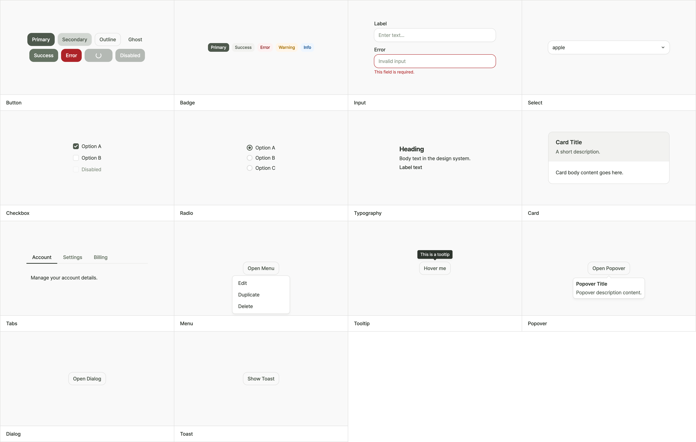

# design-farmer

[](https://github.com/ohprettyhak/design-farmer/actions/workflows/skill-quality.yml)
[](https://github.com/ohprettyhak/design-farmer/commits/main/)
[](https://github.com/ohprettyhak/design-farmer/releases)

[English](README.md) | [한국어](README.ko.md) | [日本語](README.ja.md) | **中文**

> 从种子到系统 — 从任何代码库中培育出生产级设计系统。

`design-farmer` 是一个面向 AI 编码助手的技能。它会分析你的代码仓库，提取现有的设计模式，并将其培育为结构化、无障碍的 OKLCH 原生设计系统，涵盖令牌、组件、测试和文档。

## 为什么需要它?

用 AI 助手进行氛围编码时，设计一致性往往最先失控——颜色各自为政，间距随心所欲，暗色模式无人顾及。给助手明确的设计约束确实能带来更一致的 UI，但手动搭建这套约束本身就违背了初衷。

Design Farmer 将整个流程自动化：读取代码库，理解现有内容，然后在此基础上构建（或升级）生产级设计系统。不用手写令牌文件，不用复制粘贴调色板，不用靠猜。

## 核心功能

Design Farmer 按阶段工作，适配项目的当前状态：

| 起始状态 | 执行内容 | 结果 |
|---|---|---|
| **没有设计系统** | 发现代码中的颜色与间距，转换为 OKLCH，创建令牌层级 | 基础令牌 + 语义令牌，经过对比度验证的色阶 |
| **部分系统** | 审计现有令牌，识别缺失部分（状态、角色、主题） | 在不影响现有引用的前提下补全语义覆盖 |
| **缺少交互组件** | 构建具有键盘/焦点行为的 Button、Input、Select、Dialog | 附带交互测试的统一无障碍组件 |
| **仅有浅色主题** | 通过 OKLCH 明度/色度调整生成暗色主题 | 基于同一套语义定义的双主题系统 |
| **声称"生产就绪"** | 多人审查验证，发现样式漂移和令牌误用 | 有据可查的完成状态与改进建议 |

完整流程共 12 个阶段：预检、需求访谈、仓库分析、OKLCH 模式提取、视觉预览、架构设计、主题系统、DESIGN.md 生成、令牌实现、组件库、Storybook 集成、多人审查、实时视觉 QA、文档输出、应用集成、发布准备。

## 产出成果

- **OKLCH 颜色系统** — 自动验证对比度的感知均匀色阶
- **令牌层级** — 按基础 → 语义 → 组件层级组织的令牌体系
- **无障碍组件** — 原生支持键盘导航、焦点管理与 ARIA 状态
- **双主题支持** — 同一套令牌定义下的浅色与暗色模式切换
- **DESIGN.md** — 记录设计决策的机器可读参考文档，充当项目唯一事实来源
- **验证证据** — 用明确的通过/失败标准取代"看着还行"式的审批



以上截图来自一个**从零开始的全新项目**——没有令牌、组件或设计决策。如果你的仓库中已有部分实现（一些组件、颜色变量、样式指南等），Design Farmer 会在此基础上继续构建，产出精细得多的结果。

> [!TIP]
> **想要更好的效果？** 运行前在项目根目录放一个 [`DESIGN.md`](https://github.com/VoltAgent/awesome-design-md)。
> - 用 [Stitch](https://stitch.withgoogle.com) 生成，或者
> - 从 [awesome-design-md](https://github.com/VoltAgent/awesome-design-md) 获取现成文件——收录了 Vercel、Linear、Stripe 等 58 个以上真实站点的设计系统。

## 安装

```bash
curl -fsSL https://raw.githubusercontent.com/ohprettyhak/design-farmer/main/install.sh | bash
```

安装脚本会自动检测已安装的工具，创建技能目录并下载技能包。支持的工具：**Claude Code**、**Codex CLI**、**Amp**、**Gemini CLI**、**OpenCode**。

手动安装及问题排查请参阅 [INSTALLATION.md](INSTALLATION.md)。

## 文档

- [技能规范](skills/design-farmer/SKILL.md) — 运行时参考的配置文件。
- [阶段索引](skills/design-farmer/docs/PHASE-INDEX.md) — 维护者参考的执行流程。
- [质量关卡](skills/design-farmer/docs/QUALITY-GATES.md) — 验证标准与发布检查清单。
- [维护指南](skills/design-farmer/docs/MAINTENANCE.md) — 样式一致性维护与更新流程。
- [示例画廊](skills/design-farmer/docs/EXAMPLES-GALLERY.md) — 按场景展示的前后对比与阶段对照。

## 贡献

- [贡献指南](CONTRIBUTING.md)
